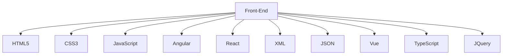

# bienvenido

[](https://github.com/ashutosh00710/github-readme-activity-graph)

<div align="center">  
   
  
  
</div> 

<div align="center">
<div align="center">
<a href="https://www.facebook.com/jhon.huarsocca.7" target="_blank"></a> 
<a href="https://www.youtube.com/channel/UChdR0NmOHnB_OCnWOKq0vGg" target="_blank"></a> 
<a href="https://www.tiktok.com/@johnhuh06?_t=8jKzjK1LECz&_r=1" target="_blank"></a>


[](https://www.linkedin.com/feed/)
[](mailto:👽@gmail.com)
</div>




<p align="center">
 
  

 
   
   
  
  
   
    
   
   
   

   
   
<p/>


 ```geojson
{
  "type": "FeatureCollection",
  "features": [
    {
      "type": "Feature",
      "id": 1,
      "properties": {
        "ID": 0
      },
      "geometry": {
        "type": "Polygon",
        "coordinates": [
          [
              [-78,-11.9],
              [-76.9,-11.9],
              [-76.9,-11.9],
              [-78,-11.9],
              [-78,-11.9]
          ]
        ]
      }
    }
  ]
}
 ```


<div align="center">
<br><p align="centre"><b>Visitors Count 👽 </b></p>  
<p align="center"></p> 
<br>
</div>


